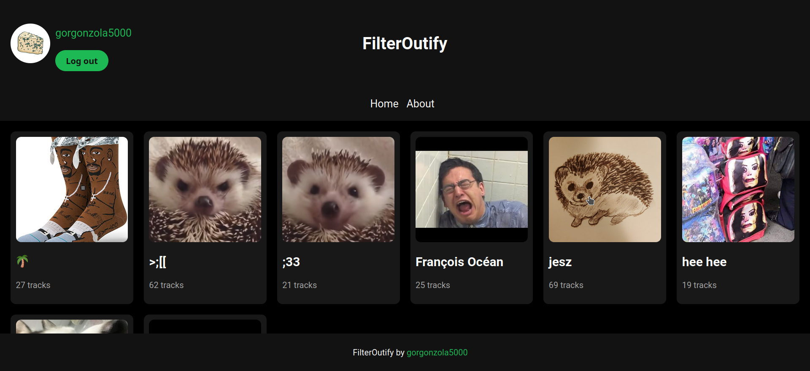

## FilterOutify
A web app built using Spotify Web API, Flask and Docker for filtering your public Spotify playlists.
You can filter out:
- all of the tracks of a specified artist
- specific tracks

## A little showcase

<p align="center">
  
&nbsp; &nbsp; &nbsp; &nbsp;
  
</p>

## How it works
- You log into Spotify and grant the app the necessary permissions. It then searches through all of your playlists to find public playlists and "worker" private playlists. "Worker" playlists are named "<your_public_playlist_name> AP". They are here so that FilterOutify doesn't mess with your actual playlists - filtering happens only in "worker" playlists.
- To use FilterOutify, click a playlist you would like to filter. If there already is a "worker" playlist then just select the tracks or artists you would like to filter out and done!
- If there is no "worker" playlist yet, you will be prompted to create one. If you decide to do so, a new "worker" playlist will be created with all* of the tracks of your selected playlist.

all* - local files cannot be copied over. You are limited to songs available on Spotify

[Docker Hub](https://hub.docker.com/repository/docker/gorgonzola5000/filteroutify/)

## How to run

- First, make a new project using Spotify Web API [here](https://developer.spotify.com/dashboard)
- Then, deploy the container:

### Using Docker Compose

- Make a Docker Compose File:
```
version: "3.8"
services:
  filteroutify:
    image: gorgonzola5000/filteroutify
    container_name: FilterOutify
    ports:
      - 5000:80
    environment:
      - UID=1000
      - GID=1000
      - CLIENT_ID=<client_id_from_your_Spotify_Web_API_project>
      - CLIENT_SECRET=<client_secret_from_your_Spotify_Web_API_project>
      - SECRET_KEY=<your_secret_key_just_random_characters>
      - REDIRECT_URI=http://<your_server_ip_address>/callback
    restart: unless-stopped
```
- Deploy the container using "docker compose up"

or

### Build from source
1. Clone this repo
2. CD into the cloned repo
3. Build the image with "docker build -t <repository/name>:<tag> ." To learn more about image tags click [here](https://docs.docker.com/engine/reference/commandline/image_build/#tag)
4. Add a Docker Compose File and edit it using your newly created image, secrets and redirect_uri
5. Deploy the container using "docker compose up"

## Tips
- If you want to access this app remotely, I recommend setting up a VPN access to your home network using Wireguard or Tailscale
- If you decide to change the port, make sure to change it in Spotify Web API project settings, .env file and Docker run command or Docker Compose file
